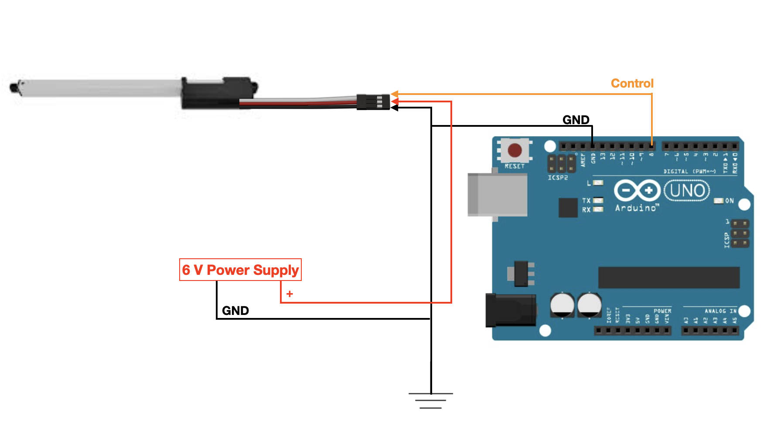
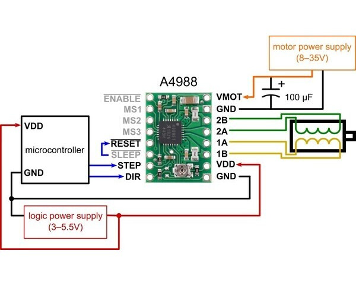

# UnravlDeviceCode
Code Repository for Unravl Device

# ME 4182 Capstone Project

## Team Members:
    
Lindsey Rodrigues

Athrey Gonella

John Bowman

Joel Saaskilahti

Varun Godbole

Natacha Ramioulle

## Testing Circuit Schematics

### Linear Servo Testing:
* Set Motor Power Supply Voltage to 6 V
* Use Arduino digital pin 8 for control wire

### Stepper Motor Testing:
 * Set Motor Power Supply Voltage to 24 V
 * VDD is 5V
 * Use Arduino digital pin 2 for DIR
 * Use Arduino digital pin 3 for STEP

