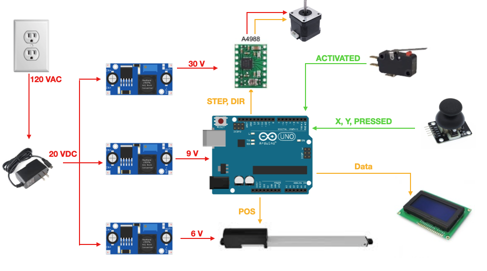

# The Unravl Device (ME 4182 Capstone Project)

**Code Repository for Unravl Device Prototype**

The objective of the Unravl Device is to enable salons to automatically unbraid box braids of varying diameters quickly, safely, and without discomfort to the stylist or the individual whose braids are being removed.

## Team Members:

Athrey Gonella

Natacha Ramioulle

Lindsey Rodrigues

John Bowman

Joel Saaskilahti

Varun Godbole

## Functionality
* Automatically unbraids box braids using a lead screw-stepper motor assembly and a linear servo
* Provides an interactive user interface with an LCD screen and joystick. User can input starting height of unraveling based on length of braid to be unbraided
* Automatically constrains range of motion using a limit switch

## Circuits

### Main Circuit
* Uses Arduino MEGA 2560 (to have enough pins)
* Powered from Wall Outlet

Connections:
* Use Arduino digital pin 2 for STEP
* Use Arduino digital pin 3 for DIR
* Use Arduino digital pin 4 for Joystick press
* Use Arduino digital pin 5 for Servo
* Use Arduino digital pins 8, 9, 10, 11, 12, and 13 for LCD screen
* Use Arduino digital pin 19 for limit switch
* Use Arduino analog pin 10 and 11 for joystick X and Y

Simplified Electrical Schematic:

### Linear Servo Testing:
* Set Motor Power Supply Voltage to 6V
* Use Arduino digital pin 8 for control wire

### Stepper Motor Testing:
 * Set Motor Power Supply Voltage to 24V
 * VDD is 5V
 * Use Arduino digital pin 2 for DIR
 * Use Arduino digital pin 3 for STEP

